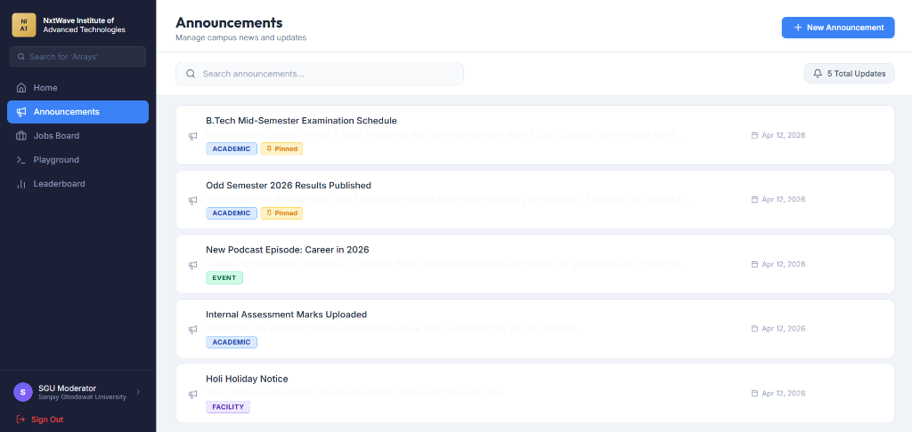
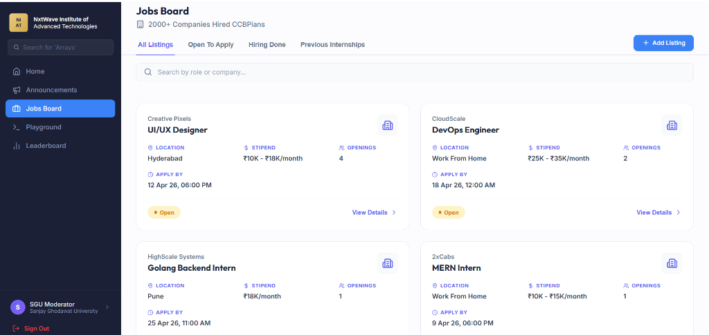

# NIAT Insider Moderator Platform

## Overview
A secure, scoped content-management dashboard that allows moderators to manage articles belonging to their assigned campus only.

DeployLink = niat-insider-moderator-zeta.vercel.app

## Screenshots

### Student Dashboard with moderator Access


### Announcements Management control by Moderator


### Jobs Board control by Moderator


📰 Articles Access & Moderator Control
The Articles page is available in the Student Portal only.
Students can create articles from the student portal.
When a student submits an article:
It is stored in the database with status = pending
It will not be visible publicly until approved
👨‍💻 Moderator Access
The moderator can log in and open the platform
The moderator can view articles created by students of their campus
The moderator cannot create articles, but can:
✏ Edit articles
❌ Delete articles
✅ Approve articles
🚫 Reject articles
🏫 Campus-Based Control
Each moderator is assigned to a specific campus
The moderator can only see:
Articles belonging to their campus students

## Setup Instructions

### Prerequisites
- Node.js (v18+)
- MongoDB running locally or a valid MongoDB URI
- Git

### Cloning the Repository
1. Clone the repository: `git clone <repository-url>`
2. Navigate to the project root: `cd niat-insider-moderator`

### Backend Setup
1. Navigate to the `server` directory: `cd server`
2. Install dependencies: `npm install`
3. Configure environment variables: The project requires `.env.test` and `.env.production` in the `server` directory.
4. Run the development server: `npm run dev`

### Frontend Setup
1. Navigate to the `client` directory: `cd client`
2. Install dependencies: `npm install`
3. Configure environment variables: The project requires `.env.development`, `.env.test`, and `.env.production` in the `client` directory.
4. Run the frontend application: `npm run dev`

## Demo Credentials
Use these credentials to test the platform. Each account is scoped to its specific campus.

| Campus | Email | Password |
|--------|-------|----------|
| **Kapil Kavuri Hub (KKH)** | `admin@kkh.edu` | `password123` |
| **Sanjay Ghodawat University (SGU)** | `admin@sgu.edu` | `password123` |


## Environment Variables

### Backend (`server/.env.test`)
```
NODE_ENV=test
PORT=5001
MONGODB_URI=mongodb://localhost:27017/niat_insider_test
JWT_SECRET=your_test_secret_here
JWT_EXPIRES_IN=1d
CORS_ORIGIN=http://localhost:3000
```

### Frontend (`client/.env.test`)
```
VITE_API_URL=http://localhost:5001/api
```

## API Endpoints

| Method   | Endpoint                  | Description                               | Access      |
|----------|---------------------------|-------------------------------------------|-------------|
| [POST]   | `/api/auth/login`         | Authenticate moderator, return JWT        | Public      |
| [GET]    | `/api/auth/me`            | Return current user from token            | Auth        |
| [GET]    | `/api/articles`           | List articles — scoped to campus          | Moderator   |
| [GET]    | `/api/articles/:id`       | Get single article                        | Moderator   |
| [PUT]    | `/api/articles/:id`       | Edit article (campus-scoped)              | Moderator   |
| [DELETE] | `/api/articles/:id`       | Delete article (campus-scoped)            | Moderator   |
| [GET]    | `/api/dashboard/schedules`| List campus schedules                     | Moderator   |
| [GET]    | `/api/dashboard/tracks`   | List campus tracks                        | Moderator   |
| [GET]    | `/api/dashboard/events`   | List campus events                        | Moderator   |
| [POST]   | `/api/snippets`           | Create/Update code environment            | Moderator   |

## Tech Stack
- MongoDB, Express.js, React, Node.js, TypeScript

## Security Considerations
- **JWT Storage:** The application currently stores the returned JWT securely inside `localStorage`. While standard for SPAs, be aware it possesses fundamental trade-offs susceptible to XSS (cross-site scripting) attacks. In a strict enterprise parameter, upgrading to `httpOnly` secure cookies is recommended for mitigating these risks natively.
